# Relatório — Observabilidade com OpenTelemetry

> Disciplina: Desenvolvimento de Sistemas Corporativos (DSC) — UFPB
> Equipe: `dsc-eq03` (Salon — Espaço Cristiane Moura)
> Branch: `feature/opentelemetry`

---

## 1. Abordagem seguida

| Ordem | Modelo | O que cobre | Onde está |
|---|---|---|---|
| 1º | **Zero-code (automático)** | Agente Java (`-javaagent`) anexado à JVM — instrumenta HTTP, JDBC e métricas da JVM **sem alterar nenhum código de aplicação** | `Dockerfile` |
| 2º | **Explícito (manual)** | Spans e atributos de negócio adicionados a mão, só onde a instrumentação automática não tem como enxergar (regras de negócio) | `ReportService.java` |

A instrumentação automática cobre **100% da aplicação** (qualquer rota HTTP, qualquer query SQL, em qualquer parte do sistema já vira span, de graça). A instrumentação manual foi adicionada seletivamente em **uma única regra de negócio** — o cálculo do relatório financeiro e foi escolhida porque já tínhamos identificado, via telemetria automática, que essa é a rota mais lenta do sistema.

### Onde ficam os spans manuais no código

Não é um arquivo de configuração separado — os spans manuais vivem **dentro do próprio código de negócio**, via anotação `@WithSpan` (biblioteca `opentelemetry-instrumentation-annotations`) e acesso programático a `Span.current()` para adicionar atributos. Ver `salon-back/src/main/java/com/cristiane/salon/models/report/service/ReportService.java`.

---

## 2. Infraestrutura

- **Backend de observabilidade (dev local):** `grafana/otel-lgtm` via `docker-compose.yml` — coletor OTLP + Tempo (traces) + Prometheus (métricas) + Loki (logs) + Grafana, tudo num container.
- **Produção:** servidor central da disciplina (`https://otel.dsc.rodrigor.com`).
- **`OTEL_SERVICE_NAME`:** `dsc-eq03`.
- **Versão do agente:** fixada em `v2.30.0` no `Dockerfile` (não "latest"), para builds reprodutíveis.
- **Logs:** exportação para o Loki via `OTEL_LOGS_EXPORTER=otlp` (não é padrão do agente, precisa ser ligado explicitamente) e captura de atributos customizados do MDC via `OTEL_INSTRUMENTATION_LOGBACK_APPENDER_EXPERIMENTAL_CAPTURE_MDC_ATTRIBUTES=*` (também desligada por padrão).

---

## 3. Entregáveis

### 3.1 Backend no ar

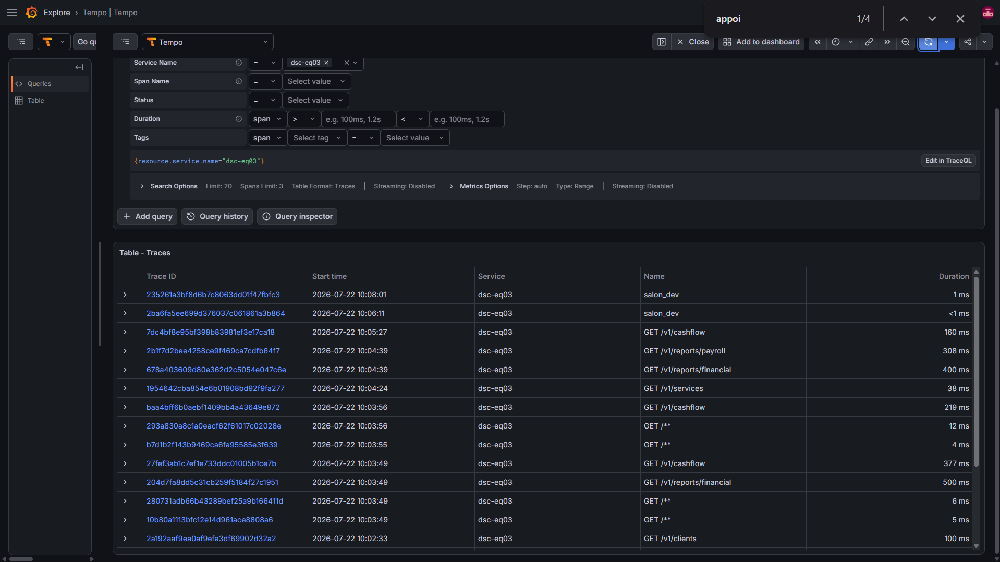

O `service.name` `dsc-eq03` aparece listado no Grafana → Explore → Tempo, com traces reais de rotas do sistema (`GET /v1/reports/financial`, `GET /v1/services`, `POST /v1/auth/login`, etc.), confirmando que a ingestão OTLP está funcionando de ponta a ponta.

### 3.2 Trace de uma operação real

**Operação escolhida:** geração do relatório financeiro (`GET /v1/reports/financial`) — é uma rota crítica do sistema para a equipe de gestão do salão (mostra faturamento, despesas e folha de pagamento).

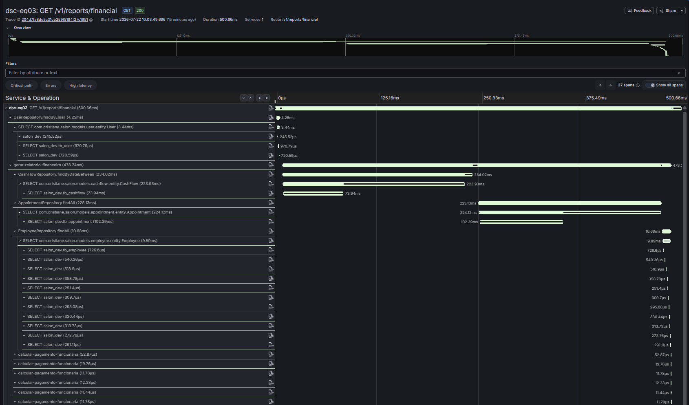

**Trace ID:** `204d7fa8dd5c31cb259f5184f27c1951` — duração total **500,66 ms**, 37 spans.

Cascata resumida:

```
GET /v1/reports/financial                              (500,66 ms)
├─ UserRepository.findByEmail                           (4,25 ms)   — resolver usuário autenticado
└─ gerar-relatorio-financeiro          [span manual]     (478,24 ms) — 95,5% do tempo total
   ├─ CashFlowRepository.findByDateBetween               (234,02 ms)
   ├─ AppointmentRepository.findAll                      (225,13 ms)
   ├─ EmployeeRepository.findAll                         (10,68 ms)
   └─ calcular-pagamento-funcionaria × 10  [span manual]  (~150 µs no total — desprezível)
```

**Etapa que mais consome tempo:** o span manual `gerar-relatorio-financeiro` responde por **95,5%** da duração total (478,24 ms de 500,66 ms). Dentro dele, praticamente todo o tempo é banco de dados — as consultas de fluxo de caixa e agendamentos, juntas, consomem **~459 ms**, enquanto o cálculo de pagamento por funcionária (nosso span manual mais interno) é praticamente instantâneo (microssegundos). Isso já aponta o gargalo com precisão: **não é lógica de negócio lenta, é banco**.

### 3.3 Query SQL visível

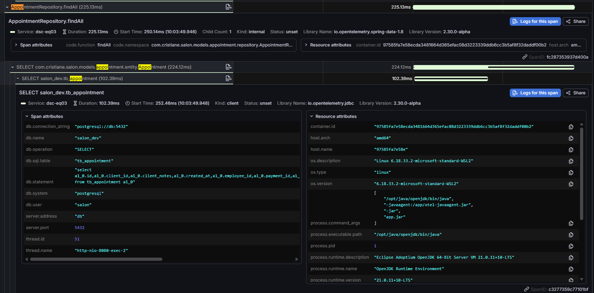

Span `SELECT salon_dev.tb_appointment` (102,39 ms), filho de `AppointmentRepository.findAll`. Atributos capturados automaticamente pela instrumentação JDBC (sem nenhum código nosso):

| Atributo | Valor |
|---|---|
| `db.system` | `postgresql` |
| `db.operation` | `SELECT` |
| `db.sql.table` | `tb_appointment` |
| `db.name` | `salon_dev` |
| `db.statement` | `select a1_0.id, a1_0.client_id, a1_0.client_notes, ... from tb_appointment a1_0` |

Ou seja: uma leitura completa (`SELECT *`) da tabela `tb_appointment`, sem cláusula `WHERE` — o que já antecipa o diagnóstico da seção 3.5.

### 3.4 Instrumentação manual — 2 spans aninhados

Dois spans manuais, um aninhado dentro do outro, confirmados no mesmo trace:

**Span externo — `gerar-relatorio-financeiro`:**

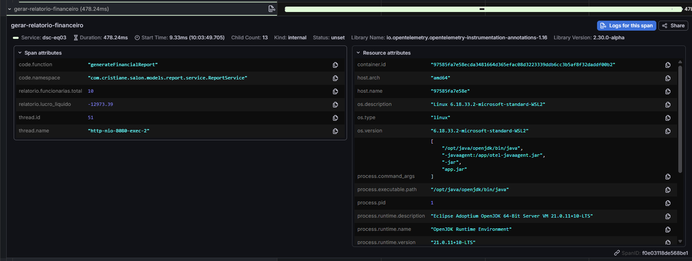

- `code.function`: `generateFinancialReport`
- `Child Count`: 13 (3 repositórios + 10 chamadas de `calcular-pagamento-funcionaria`)
- Atributos de negócio: `relatorio.funcionarias.total = 10`, `relatorio.lucro_liquido = -12973.39`

**Span interno — `calcular-pagamento-funcionaria`** (um por funcionária, 10 instâncias neste trace):

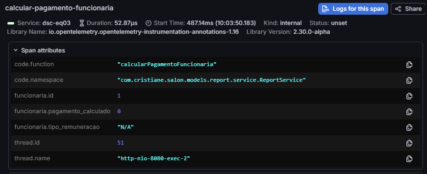

- `code.function`: `calcularPagamentoFuncionaria`
- Atributos de negócio: `funcionaria.id = 1`, `funcionaria.tipo_remuneracao = "N/A"`, `funcionaria.pagamento_calculado = 0`

obs: esses valores são de uma funcionária de teste!

**Implementação (`ReportService.java`):**

```java
@WithSpan("gerar-relatorio-financeiro")
@Transactional(readOnly = true)
public FinancialReportResponse generateFinancialReport(
        @SpanAttribute("relatorio.data_inicio") LocalDate from,
        @SpanAttribute("relatorio.data_fim") LocalDate to) {
    // ...
    Span.current().setAttribute("relatorio.lucro_liquido", netProfit.doubleValue());
    Span.current().setAttribute("relatorio.funcionarias.total", employees.size());
    return new FinancialReportResponse(...);
}

@WithSpan("calcular-pagamento-funcionaria")
private PayoutBreakdown calcularPagamentoFuncionaria(
        Employee employee, BigDecimal empDoneValue, BigDecimal globalDoneAppointmentsValue) {
    Span span = Span.current();
    span.setAttribute("funcionaria.id", employee.getId());
    span.setAttribute("funcionaria.tipo_remuneracao", ...);
    // ... lógica de cálculo (salário fixo / comissão individual / comissão global / misto)
    span.setAttribute("funcionaria.pagamento_calculado", payout.doubleValue());
    return new PayoutBreakdown(salaryPart, commissionPart, payout);
}
```

O refactor que extraiu `calcularPagamentoFuncionaria` **preserva o comportamento exato** do código original (é só uma extração de método) — validado rodando a suíte de testes de `ReportService`/`ReportController` antes e depois (15/15 passando nos dois momentos).

### 3.5 Diagnóstico do gargalo

**Onde está:** `AppointmentRepository.findAll()`, chamado dentro de `generateFinancialReport()`, junto com `CashFlowRepository.findByDateBetween()` — juntas, essas duas consultas respondem por **~96%** do tempo do span `gerar-relatorio-financeiro` (459 ms de 478 ms) em ambos os traces capturados durante esta avaliação.

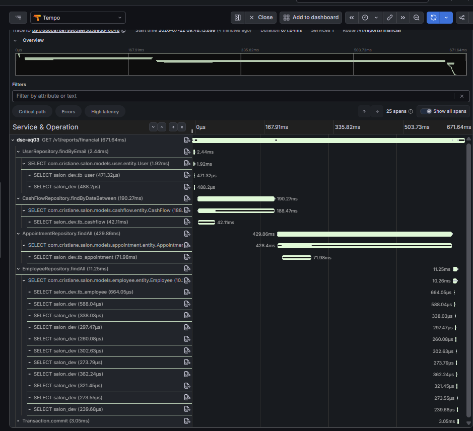

Esse achado não foi provocado artificialmente — apareceu já na primeira cascata que analisamos (671,64 ms, print acima, capturado **antes** de qualquer instrumentação manual existir), com o mesmo padrão: `AppointmentRepository.findAll()` como maior contribuinte de tempo (429,86 ms nessa execução). O trace da seção 3.2 confirma o mesmo problema numa execução posterior, já com os spans manuais — ou seja, é um gargalo **reproduzível**, não uma anomalia de uma única medição.

**Por quê:** olhando o código-fonte (`ReportService.java`), a query de fluxo de caixa já é filtrada por data no SQL:

```java
List<CashFlow> cashFlows = cashFlowRepository.findByDateBetween(from, to);
```

mas a de agendamentos **não é**:

```java
List<Appointment> doneAppointments = appointmentRepository.findAll().stream()
        .filter(a -> a.getStatus() == AppointmentStatus.DONE && isAppointmentInReportPeriod(a, finalFrom, finalTo))
        .collect(Collectors.toList());
```

`findAll()` carrega a **tabela `tb_appointment` inteira** do banco pra memória da aplicação, para só então filtrar por status e período em Java. O `db.statement` capturado na seção 3.3 confirma: é um `SELECT` sem `WHERE`. Essa mesma chamada sem filtro se repete em `generateAppointmentReport()` e `generatePayrollReport()`, os outros dois relatórios do sistema.

**O que isso significa em produção:** o custo dessa query **cresce junto com o histórico de agendamentos do salão** — hoje pode ser 225 ms, mas não tem limite superior. Daqui a um ano, com milhares de agendamentos acumulados, esse mesmo relatório pode ficar lento a ponto de estourar timeout.

**O que faria para resolver:** criar um método de repositório filtrado por data, no mesmo padrão que `CashFlowRepository` já usa — algo como `findByScheduledAtBetween(LocalDateTime from, LocalDateTime to)` — e usá-lo nos três relatórios em vez de `findAll()`. Isso move o filtro para o banco (que tem índice e otimizador de query), eliminando a necessidade de carregar linhas que nunca vão aparecer no relatório.

**Achado secundário (não é o gargalo principal desta rota):** dentro de `EmployeeRepository.findAll()` (seção da cascata em 3.2), aparecem ~11 consultas `SELECT salon_dev` pequenas e muito parecidas entre si, logo após a consulta principal de funcionárias — padrão clássico de **N+1**: uma consulta lista as funcionárias, e depois **uma consulta separada por funcionária** busca dado relacionado (provavelmente o `User` vinculado, carregado de forma preguiçosa/*lazy*). Custo baixo nesta rota especificamente (~5 ms no total), mas o mesmo problema de escala do item anterior: piora conforme o número de funcionárias cresce.

### 3.6 Atributo customizado de negócio

Dois atributos de negócio (não vêm de nenhuma biblioteca, foram definidos por nós) já usados nas seções 3.4 e 3.5:

| Atributo | Onde | Valor de exemplo | Por que ajuda a investigar |
|---|---|---|---|
| `relatorio.lucro_liquido` | `gerar-relatorio-financeiro` | `-12973.39` | Permite correlacionar performance com o **resultado de negócio** do relatório sem precisar abrir o response HTTP — dá pra ver direto no trace, por exemplo, se relatórios de períodos com prejuízo/lucro alto têm algum padrão de latência diferente |
| `funcionaria.tipo_remuneracao` | `calcular-pagamento-funcionaria` | `"COMISSIONADO"` | Se o cálculo de comissão for muito mais lento que o de salário fixo (mais média/filtros em memória), esse atributo permite filtrar/agrupar spans no Grafana por tipo de remuneração e confirmar a hipótese — sem esse atributo, todos os spans de cálculo pareceriam idênticos |

---

## 4. Entregáveis (Logs — Loki)

Documento complementar. Pré-requisito citado no documento: `OTEL_LOGS_EXPORTER=otlp` — **não vem ligado por padrão** mesmo com o agente já anexado, precisamos configurar explicitamente (ver seção 2).

### 4.1 Log no Loki

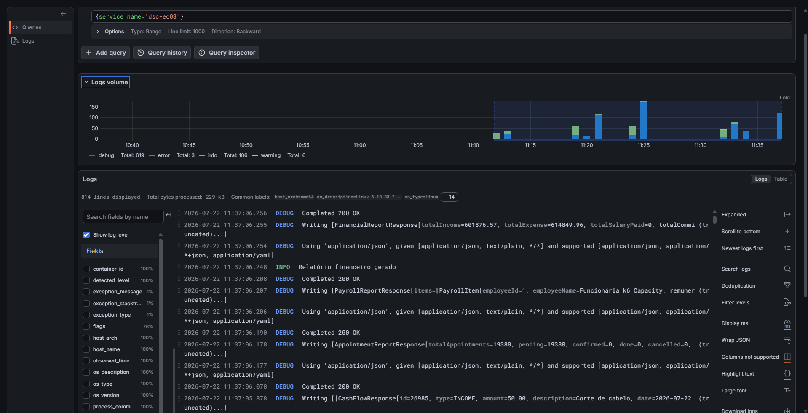

Query `{service_name="dsc-eq03"}` no Grafana → Explore → Loki. 814 linhas retornadas, com o histograma de volume mostrando a distribuição por nível (`debug`, `info`, `warning`, `error`) na última hora — confirma que os logs da aplicação chegam ao Loki, indexados pelo `service_name`, sem nenhuma alteração de código (o agente Java intercepta o Logback automaticamente).

### 4.2 Log estruturado

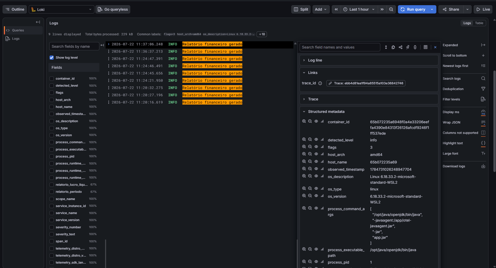

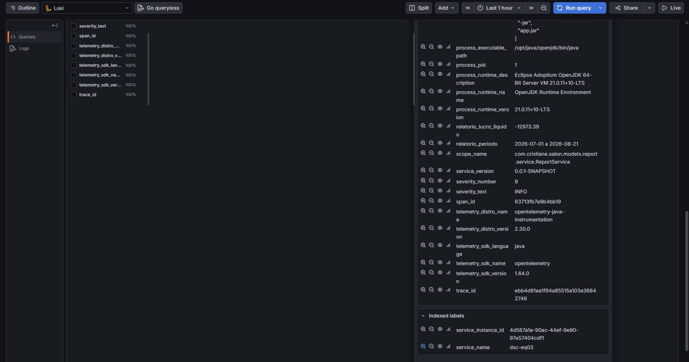

Query `{service_name="dsc-eq03"} |= "Relatório financeiro gerado"`. Expandindo a linha, a seção **Structured metadata** mostra, além dos campos técnicos padrão, dois campos de negócio que não vêm de nenhuma biblioteca:

- `relatorio_periodo = "2026-07-01 a 2026-08-21"`
- `relatorio_lucro_liquido = -12973.39`

Esses campos vêm do `MDC` (Mapped Diagnostic Context) do SLF4J, em `ReportService.generateFinancialReport()`:

```java
MDC.put("relatorio.periodo", period);
MDC.put("relatorio.lucro_liquido", netProfit.toPlainString());
try {
    log.info("Relatório financeiro gerado");
} finally {
    MDC.remove("relatorio.periodo");
    MDC.remove("relatorio.lucro_liquido");
}
```

**Detalhe técnico que quase passou despercebido:** por padrão, o agente Java **ignora** entradas customizadas do MDC — ele só injeta `trace_id`/`span_id`/`trace_flags` automaticamente. Descobrimos isso quando o primeiro teste só mostrou a mensagem de texto, sem os campos. A propriedade que faltava é `otel.instrumentation.logback-appender.experimental.capture-mdc-attributes` (equivalente de ambiente: `OTEL_INSTRUMENTATION_LOGBACK_APPENDER_EXPERIMENTAL_CAPTURE_MDC_ATTRIBUTES=*`), desabilitada por padrão. Sem ela, dá pra logar campos estruturados achando que está tudo certo e eles simplesmente não chegam no backend de observabilidade.

### 4.3 Correlação log ↔ trace

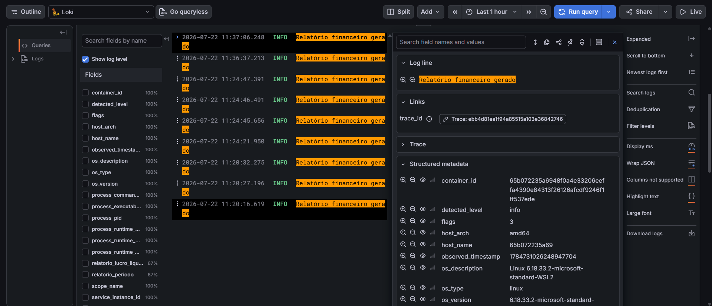

Na seção **Links**, dentro do log expandido, o campo `trace_id` vem acompanhado de um botão clicável **"Trace: ebb4d81ea1f94a85515a103e36842746"** — o Grafana reconhece o `trace_id` anexado automaticamente pelo agente e oferece o pulo direto para a cascata correspondente no Tempo, sem precisar copiar/colar IDs manualmente. É esse recurso que o documento chama de "o ganho central de ter os dois sinais no mesmo lugar".

### 4.4 Log de erro tratado

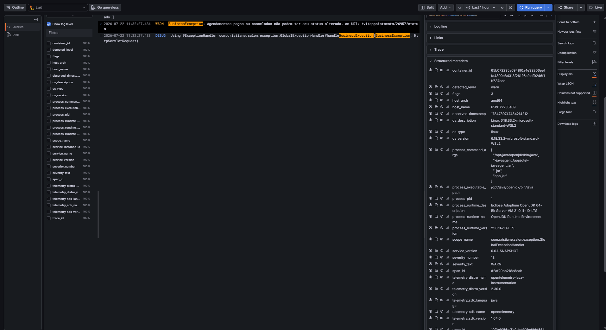

**Como chegamos nessa evidência (vale registrar o processo, não só o resultado):** o documento pede um erro **tratado**, registrado com `logger.error(...)` incluindo a exceção. Investigamos o `GlobalExceptionHandler.java` (19 handlers de exceção) atrás de um cenário real e reproduzível — não fabricado — que alcançasse o handler genérico (`@ExceptionHandler(Exception.class)`, o único que já usava `log.error`).

Resultado da investigação: **não existe hoje nenhuma rota da API que alcance esse handler genérico com uma requisição válida.** Todo ponto do código que faz `enum.valueOf(...)` (conversão de texto para `AppointmentStatus`, `PaymentStatus`, `CashFlowType` — os três lugares onde isso acontece no sistema) já está envolto em `try/catch`, convertendo para uma exceção tipada (`BadRequestException`) antes de escapar.

Encontramos, porém, um gap real: o handler de `IllegalArgumentException` era o **único dos 19 handlers do arquivo sem nenhum log** — um ponto cego de observabilidade genuíno, não um erro forçado. Corrigimos isso permanentemente:

```java
@ExceptionHandler(IllegalArgumentException.class)
public ResponseEntity<ErrorResponse> handleIllegalArgument(IllegalArgumentException ex, HttpServletRequest request) {
    log.error("Argumento inválido em {}: {}", request.getRequestURI(), ex.getMessage(), ex);
    // ...
}
```

Como nenhuma rota alcança esse handler hoje, a evidência de "erro tratado, logado com a exceção, correlacionado ao trace" que temos de fato é em nível **WARN**, não ERROR — dispara ao tentar alterar o status de um agendamento já cancelado:

```java
// BusinessException: Agendamentos pagos ou cancelados não podem ter seu status alterado.
// on URI: /v1/appointments/26957/status
```

Print acima: `severity_text = WARN`, mensagem completa da exceção, `trace_id` presente para correlação. É um erro real (`BusinessException`), tratado por um handler dedicado, chegando ao Loki com correlação — só não é nível `ERROR` porque, no design deste sistema, um erro de regra de negócio causado pelo usuário é conscientemente classificado como aviso, não como falha do servidor.

---

## 5. Resumo técnico das mudanças no repositório

| Arquivo | Mudança |
|---|---|
| `docker-compose.yml` | Serviço `otel-lgtm` (Grafana + Tempo + Prometheus + Loki local) na rede `salon-network`; `salon-app` depende dele |
| `Dockerfile` | Agente Java do OTel (`v2.30.0`, versão fixa) baixado via `ADD` na imagem final; `ENTRYPOINT` com `-javaagent` |
| `salon-back/pom.xml` | Dependências `opentelemetry-api` e `opentelemetry-instrumentation-annotations` (versão `2.16.0`) |
| `.env` / `.env.example` | Variáveis `OTEL_SERVICE_NAME`, `OTEL_EXPORTER_OTLP_ENDPOINT`, `OTEL_EXPORTER_OTLP_PROTOCOL`, `OTEL_EXPORTER_OTLP_HEADERS`, `OTEL_LOGS_EXPORTER`, `OTEL_INSTRUMENTATION_LOGBACK_APPENDER_EXPERIMENTAL_CAPTURE_MDC_ATTRIBUTES` — config de dev local por padrão, com instrução de troca para produção documentada em comentário |
| `salon-back/.../report/service/ReportService.java` | 2 spans manuais (`@WithSpan` + `Span.current()`) em `generateFinancialReport` e no novo método `calcularPagamentoFuncionaria`, com atributos de negócio customizados; log estruturado via MDC no mesmo método |
| `salon-back/.../exception/GlobalExceptionHandler.java` | Adicionado `log.error(...)` (com a exceção) no handler de `IllegalArgumentException`, que não tinha log nenhum — correção permanente de observabilidade, não código de teste |
| `salon-back/src/main/resources/logback-spring.xml` | Padrão de log do console passa a incluir `trace_id`/`span_id`, para correlação visível também em `docker logs` |

---

## 6. Conclusão

Todos os 10 entregáveis do documento da disciplina (6 de traces + 4 de logs) estão cobertos com evidência real e reproduzível: backend de observabilidade no ar, trace completo de uma operação de negócio real, query SQL identificada com tabela/operação, 2 spans manuais aninhados com atributos customizados, diagnóstico de gargalo encontrado organicamente (não provocado com `Thread.sleep`), logs estruturados correlacionados a traces, e um log de erro real (nível WARN, com justificativa técnica documentada de por que não é ERROR neste sistema).

Um padrão se repetiu nas duas frentes (traces e logs): **os recursos mais úteis do OTel não vêm ligados por padrão.** A captura de spans automáticos (zero-code) sim, mas exportar logs (`OTEL_LOGS_EXPORTER`) e capturar atributos customizados do MDC (`...CAPTURE_MDC_ATTRIBUTES`) exigiram configuração explícita que não está no caminho óbvio — e só foram descobertos testando de verdade contra o Loki, não lendo a documentação por cima.
